<h1 align="center">基于Spring Boot 的手工艺品销售系统【带论文】</h1>

- <b>完整代码获取地址：从戎源码网 ([https://armycodes.com/](https://armycodes.com/))</b>
- <b>技术探讨、资料分享，请加QQ群：692619798</b>
- <b>作者微信：19941326836  QQ：952045282</b>
- <b>承接计算机毕业设计、Java毕业设计、Python毕业设计、深度学习、机器学习</b>
- <b>选题+开题报告+任务书+程序定制+安装调试+论文+答辩ppt 一条龙服务</b>
- <b>所有选题地址 ([https://github.com/Descartes007/allProject](https://github.com/Descartes007/allProject)) </b>

## 一、项目介绍

本项目为基于 Spring Boot 的手工艺品销售系统，系统角色为 后台管理员、商家、前端用户，主要功能如下：
### 管理员（后台）：
- 基本操作：登录/登出、修改密码、获取/修改个人信息。
- 用户管理：用户列表、查看/新增/编辑/删除用户、重置密码、分页查询。
- 商品管理：商品列表/详情/新增/编辑/逻辑删除、上/下架、批量导入（.xls）。
- 订单管理：订单列表/详情、退款、发货（填写快递号）、确认收货、订单状态流转、批量下单处理。
- 内容管理：资讯（新闻）CRUD、论坛帖子管理、商品评论后台管理。
- 商家管理：商家账号审核与管理。
### 商家：
- 店铺信息管理、自己的商品增删改查、商品批量导入、查看商品销售与订单、处理订单（发货、订单状态管理）。
### 前端用户（买家）：
- 账号操作：注册/登录/登出/个人信息管理。
- 商品浏览：商品列表、商品详情（访问计数）、按字典字段友好展示。
- 购物车：添加/删除/查看购物车（支持批量下单）。
- 下单与支付：单笔下单与批量下单、余额/积分支付、余额校验与扣减。
- 订单管理：查看订单列表/详情、确认收货、申请退款、评价商品。
- 地址管理：收货地址增删改查。
- 社区功能：查看/发布论坛帖子、查看资讯。

## 二、项目技术

- 编程语言： Java 8
- 框架：Spring Boot 2.x,MyBatis / MyBatis-Plus,MySQL、Fastjson、Hutool

## 三、运行环境

- JDK版本：1.8及以上都可以
- 操作系统：Windows7/10、MacOS
- 开发工具：IDEA、Ecplise、MyEclipse都可以

## 四、数据库配置文件

- npm版本：6.14.13及以上都可以
- Redis版本：3.2.100及以上都可以
- 文件名：application.yml
- 编码类型：utf8

## 论文截图

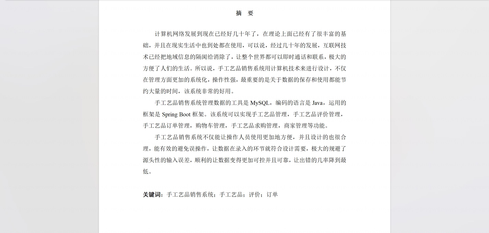

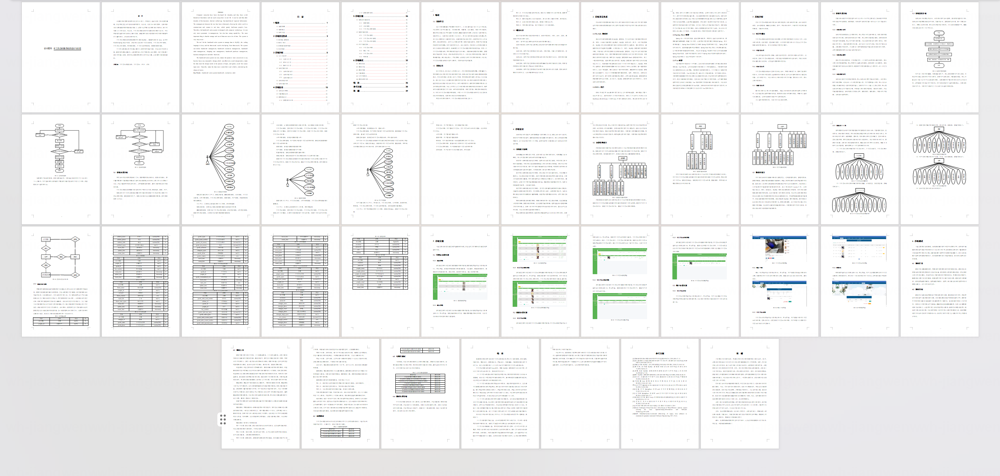

## 系统截图

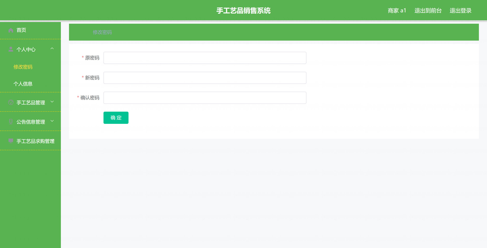

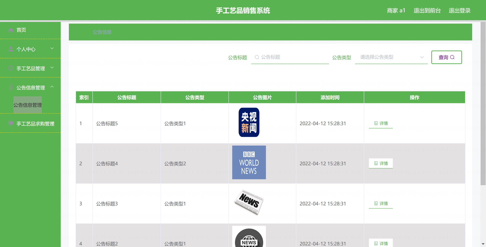

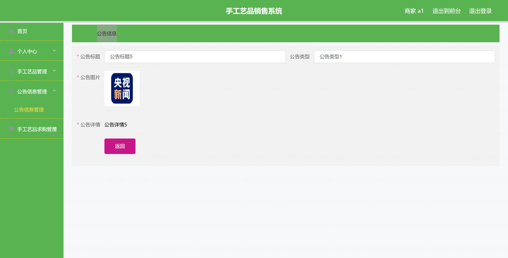

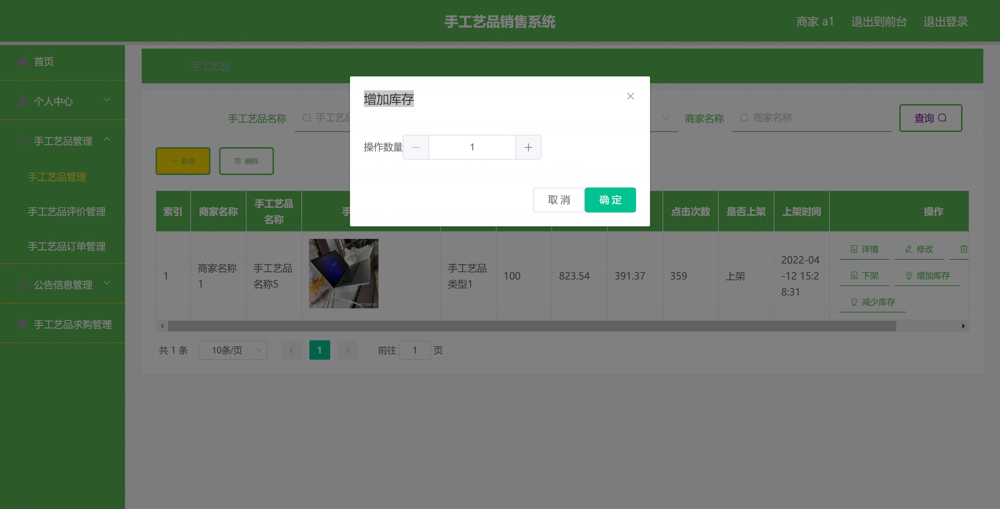

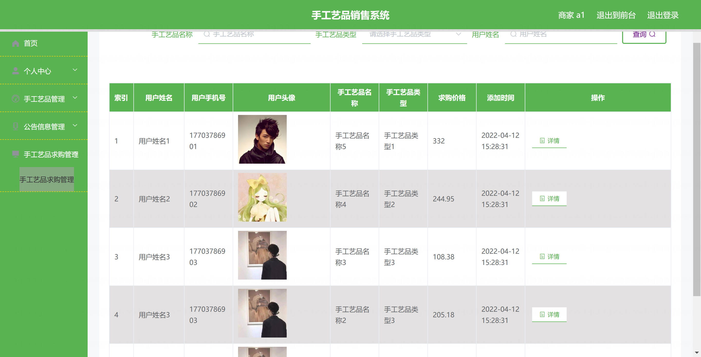

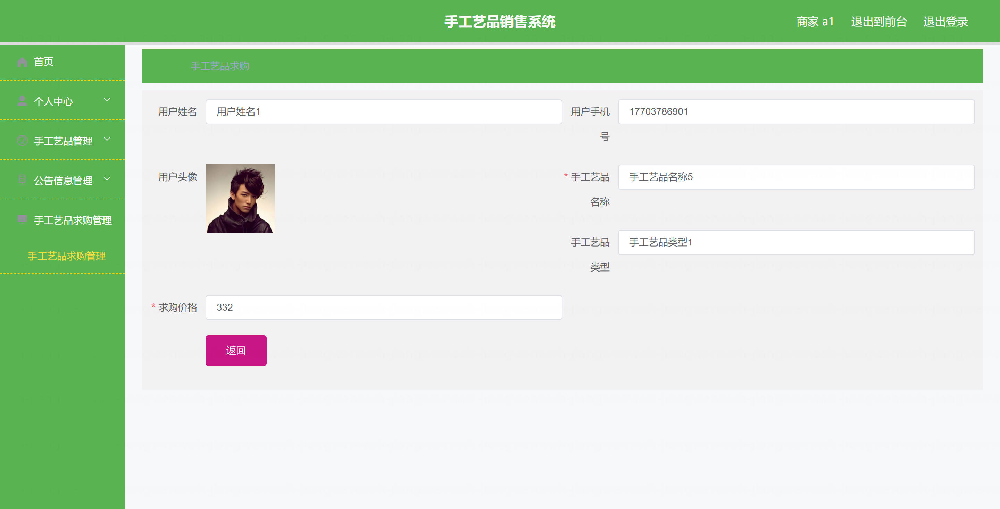

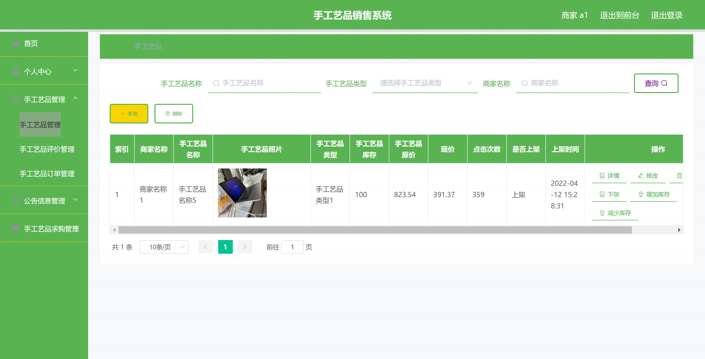

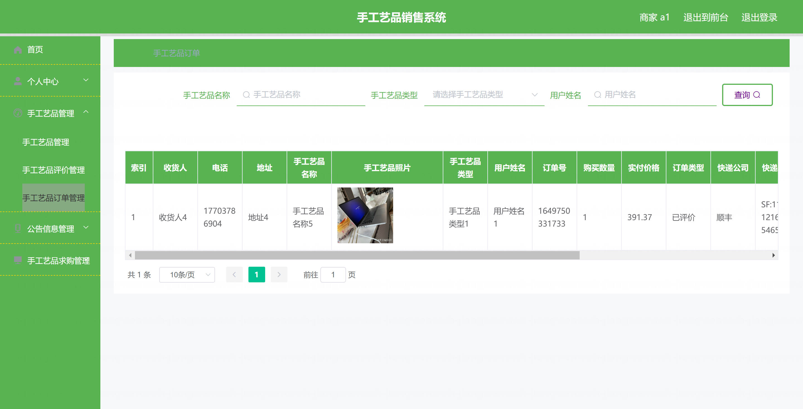

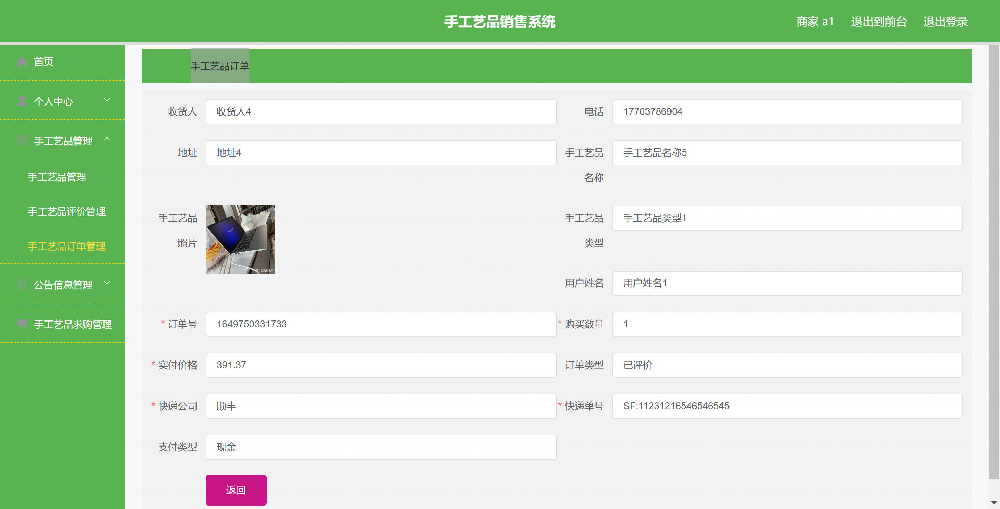

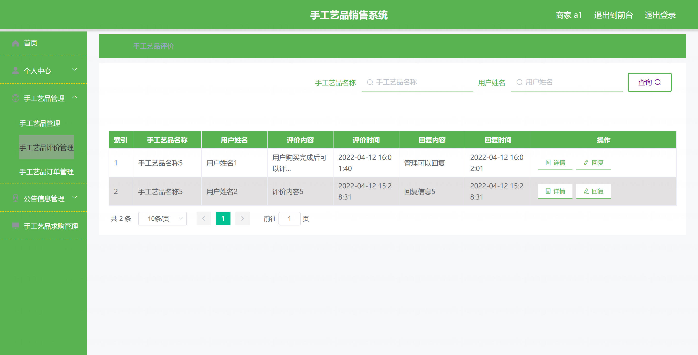
